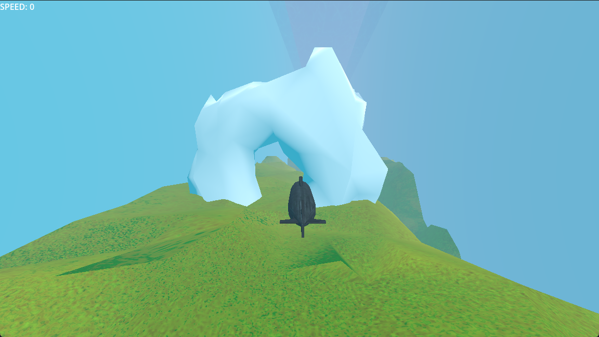
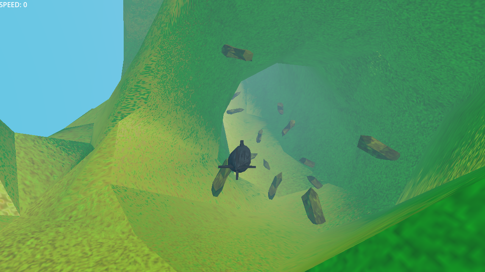

# Naval Survival
### alpha v0.1

## Final Concept:
an infinite runner game where you drive a submarine through terrain, avoiding naval mines, rocky terrain, torpedos and ships, all while staying hidden from ships above that will drop explosives into the water when you are near the surface.

## MVP:
a submarine that moves through terrain underwater.
Date finished: 8/6/2023 3:20PM

## Summary:
This is the result of a game jam for Game Dev Club at Viera High School from 8/4/2023-8/6/2023

### Attendees:
- Fred Schmidt
- Andrew Sun
- Logan Hernandez

Godot version 4.1 .NET
https://github.com/godotengine/godot/releases/download/4.1.1-stable/Godot_v4.1.1-stable_mono_win64.zip

## Software used:
[Godot version 4.1 .NET](https://github.com/godotengine/godot/releases/download/4.1.1-stable/Godot_v4.1.1-stable_mono_win64.zip)



No current way to download as an EXE file, only way to play is through opening the project through Godot 4.1
To download with git (if you have it):
```
Open file explorer to where you want the game
Open a terminal in this directory
type "git clone https://github.com/1101206/naval_survival.git"
enjoy
```
